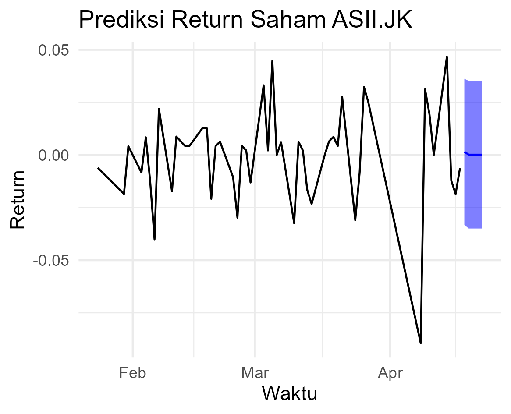
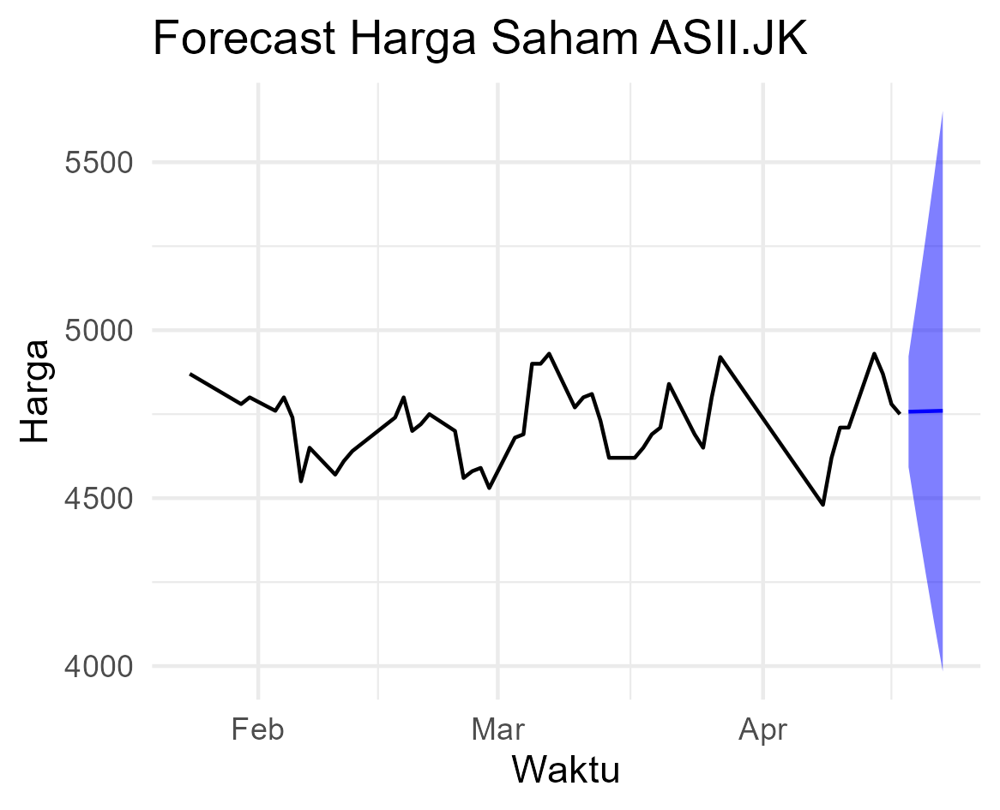

# Time Series Forecasting: Saham ASII.JK (Astra International)

Analisis data historis saham PT Astra International Tbk (ASII.JK) dengan pendekatan **time series modeling (MA(1))** menggunakan bahasa pemrograman R. Proyek ini menampilkan proses data cleaning, eksplorasi, modeling, dan forecasting return serta harga saham harian.

---

## Tujuan Proyek

- Mengambil dan memproses data historis harga penutupan saham ASII.JK dari Yahoo Finance
- Menghitung **simple return harian**
- Mengidentifikasi dan membangun model **Moving Average MA(1)**
- Melakukan perbandingan model dengan AR(1) dan ARMA(1,1)
- Memprediksi return dan harga saham dalam jangka pendek (5 hari)
- Visualisasi prediksi dengan **confidence interval**

---

## Tools & Library

- Bahasa: `R`
- Library: `quantmod`, `tseries`, `forecast`, `ggplot2`, `dplyr`

---

## Dataset

- Sumber: Yahoo Finance (`ASII.JK`)
- Periode: **1 Agustus 2021 – 20 April 2025**
- Variabel utama: Harga penutupan harian (`Close`)

---

## Visualisasi Hasil

### Return Forecast


### Harga Saham Forecast


---

## Hasil Utama

- Model **MA(1)** menunjukkan performa baik berdasarkan AIC/BIC dan diagnostik residual
- Prediksi return menunjukkan fluktuasi kecil dalam 5 hari ke depan
- Harga saham diproyeksikan naik/turun dalam rentang tertentu dengan confidence interval 95%

---

## Struktur File

```
📂 asii-stock-forecast/
├── 📄 README.md
├── 📄 asii_forecast.R    
├── 📁 plots/              
└── 📁 output/             
```

---

# Insights
Model Moving Average MA(1) dipilih karena memiliki performa terbaik berdasarkan nilai AIC dan BIC dibandingkan model AR(1) dan ARMA(1,1). Selain itu, hasil diagnostik residual menunjukkan bahwa tidak ada autokorelasi yang signifikan, yang berarti model ini cukup layak untuk digunakan dalam prediksi jangka pendek.

Prediksi return dalam 5 hari ke depan menunjukkan pergerakan yang relatif stabil, tanpa lonjakan signifikan. Hal ini mengindikasikan bahwa saham ASII.JK berada dalam fase yang cenderung tenang dan tidak volatil dalam jangka sangat pendek.

Jika dikonversi ke harga saham, prediksi menunjukkan rentang harga yang masih dalam batas wajar, dengan interval kepercayaan yang cukup sempit. Ini menunjukkan bahwa ketidakpastian model relatif rendah.

Dari sisi evaluasi model, error pada training set cukup kecil:

RMSE: 0.0177

MAE: 0.0129

MASE: 0.6397, menunjukkan bahwa model ini lebih baik dibandingkan naive forecast

Nilai-nilai ini mendukung bahwa model MA(1) sudah cukup efisien dan akurat dalam menangkap pola return harian ASII.JK.

Model ini dapat dijadikan sebagai baseline untuk analisis teknikal jangka pendek, namun sebaiknya tetap dikombinasikan dengan indikator teknikal tambahan atau data fundamental untuk mendukung pengambilan keputusan investasi yang lebih menyeluruh.

## Contact me at

Saskia – [https://linkedin.com/in/saskiaiqlimab]
Email: [saskiabilhaq@gmail.com]  
Portofolio lainnya: [https://github.com/saskiaab]
